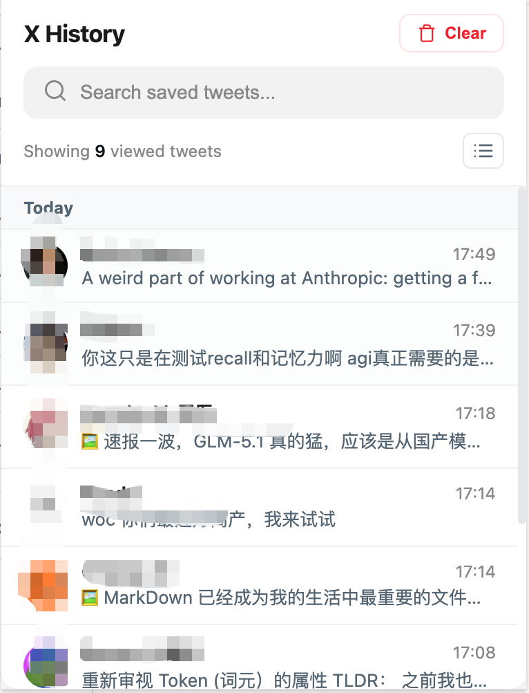
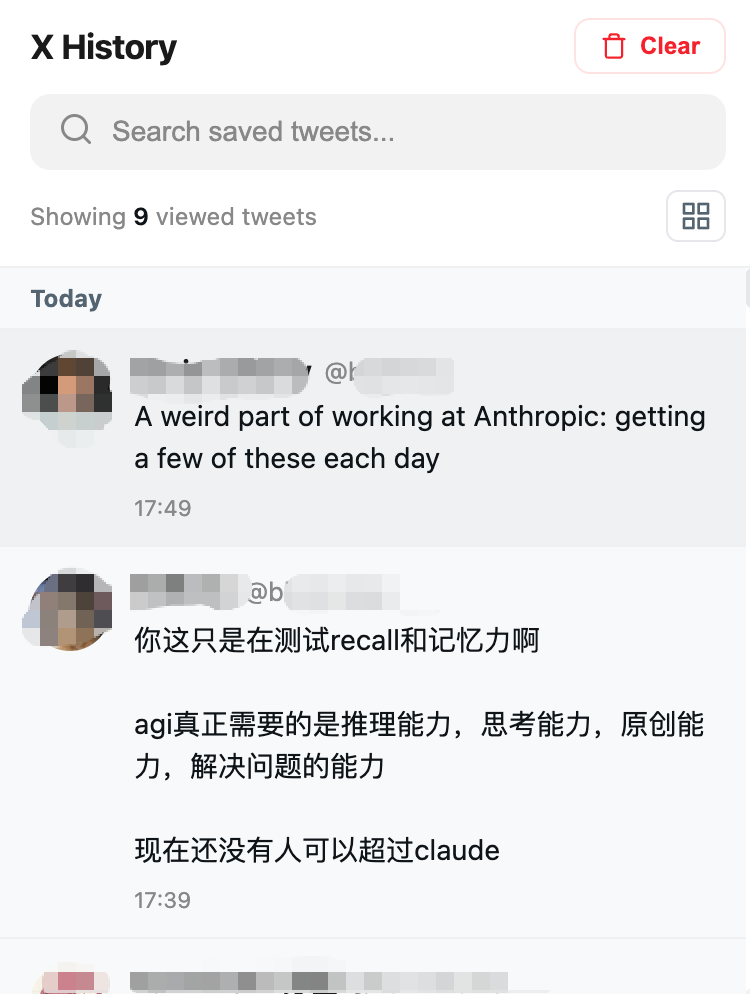

# X History

**English** | [中文](README_CN.md)

A lightweight Chrome extension that automatically records tweets you read on X (Twitter). Never lose a tweet you've seen again.

<p align="center">
  
  &nbsp;&nbsp;
  
</p>

## Features

- **Auto-record** — Click into any tweet and it's saved automatically
- **Search** — Find saved tweets by author name, handle, or content
- **Compact / Full view** — Toggle between a scannable list and full content view
- **Date grouping** — Tweets grouped by day (Today, Yesterday, etc.) for easy navigation
- **Profile avatars** — Shows author avatars alongside saved tweets
- **Clear cache** — One-click cleanup to free storage
- **Privacy-first** — All data stored locally, zero network requests, no tracking

## Install

### Option 1: Download ZIP (Easiest)

1. Click the green **Code** button at the top of this page
2. Select **Download ZIP**
3. Unzip the downloaded file
4. Open Chrome and go to `chrome://extensions`
5. Enable **Developer mode** (toggle in the top right corner)
6. Click **Load unpacked**
7. Select the unzipped `x-timeline-history-main` folder
8. Done! You'll see the X History icon in your toolbar

### Option 2: Git Clone

```bash
git clone https://github.com/LGCALIVE/x-timeline-history.git
```

Then follow steps 4-8 above.

## Usage

### Recording Tweets

1. Browse X (twitter.com / x.com) as you normally do
2. **Click into any tweet** to view its detail page
3. The tweet is automatically saved — no buttons to press

### Viewing History

1. Click the **X History** icon in Chrome's toolbar
2. Your reading history is displayed with the most recent at top
3. Tweets are grouped by date (Today, Yesterday, etc.)

### Searching

Type in the search bar to filter by:
- Tweet content
- Author display name
- @handle

### View Modes

Click the toggle button in the top right to switch between:
- **Compact mode** — One line per tweet, scan quickly
- **Full mode** — See complete tweet text and images

### Opening Original Tweet

Click any tweet in the list to open the original on X in a new tab.

### Clearing Data

Click **Clear** to delete all saved tweets and free storage space.

## How It Works

The extension runs a content script on X/Twitter pages. When you navigate to a tweet detail page (`x.com/user/status/123`), it reads the tweet content from the page DOM and saves it to `chrome.storage.local`. No API calls, no external servers, no data leaves your browser.

## Permissions

| Permission | Why |
|---|---|
| `storage` | Save tweets locally |
| `unlimitedStorage` | Support up to 10,000 saved tweets |
| Content script on `x.com` / `twitter.com` | Read tweet content from the page |

No `tabs`, `webRequest`, or other sensitive permissions required.

## Storage

- Each tweet: ~1 KB
- 10,000 tweets: ~10 MB
- Data never leaves your browser

## Tech Stack

- Vanilla JavaScript, Vanilla CSS
- Chrome Extension Manifest V3
- Zero external dependencies
- Total size: ~50 KB

## Author

Created by **[Jay Liu](https://github.com/LGCALIVE)**

## License

[MIT](LICENSE)
